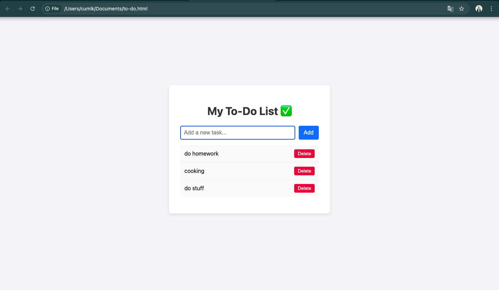

# Simple Vanilla JS To-Do List App

A minimalist, single-file to-do list application built with HTML, CSS, and plain ("vanilla") JavaScript. This project is designed as a perfect starting point for beginners to understand the fundamentals of DOM manipulation and event handling in JavaScript.

---

## ✨ Features

* **Add Tasks**: Quickly add new tasks to your list via an input field.
* **Mark as Complete**: Click on a task to toggle its completion status, which visually strikes it through.
* **Delete Tasks**: Remove tasks you no longer need with a dedicated delete button.
* **Responsive Design**: The layout is fluid and works on various screen sizes.
* **No Frameworks**: Built with only core web technologies (HTML, CSS, JS) for a lightweight and easy-to-understand codebase.

---

## 🚀 How to Use

No installation or build steps are required!

1.  **Download the Code**: Clone this repository or simply download the `index.html` file.
2.  **Open in Browser**: Open the `index.html` file directly in your web browser (e.g., Google Chrome, Firefox, Safari).
3.  **Start Managing Tasks**: That's it! The application is ready to use.

---

## 🛠️ Technologies Used

* **HTML5**: For the basic structure and content of the app.
* **CSS3**: For all styling, including layout, colors, and the "completed" state.
* **JavaScript (ES6+)**: For all the application logic, including adding, deleting, and marking tasks as complete.

---

## 🗺️ Future Improvements (Roadmap)

This simple application is a great foundation. Here are some potential features to add next:

* [ ] **Local Storage Persistence**: Save tasks in the browser's local storage so they don't disappear when the page is refreshed.
* [ ] **Edit Functionality**: Add an "Edit" button to allow users to modify existing tasks.
* [ ] **Task Filtering**: Implement buttons to filter the view between "All," "Active," and "Completed" tasks.
* [ ] **Due Dates & Priorities**: Allow users to add a due date or a priority level to each task.
* [ ] **Modular Codebase**: Split the CSS and JavaScript into separate files (`style.css`, `script.js`) for better organization as the project grows.
* [ ] **Improved UI/UX**: Add subtle animations for adding and deleting tasks to make the user experience smoother.

---

## 📄 License

This project is licensed under the MIT License. See the `LICENSE` file for details.
